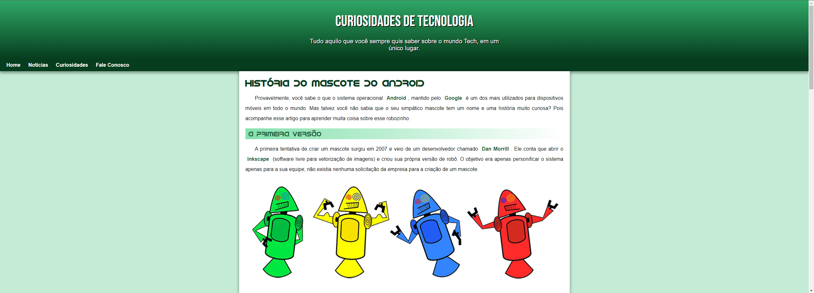

# História do mascote do Android

> Conheça a história do mascote Android neste site informativo.

## Sobre o projeto 

Este site foi desenvolvido para aprimorarmos nossas habilidades em HTML e CSS, adquiridas no curso de HTML e CSS ministrado por @gustavoguanabara no @cursoemvideo. O website fornece informações relevantes sobre o processo criativo envolvido na concepção do icônico robôzinho do Android 🤖.

## Ajustes e melhorias

O projeto ainda está em desenvolvimento e as próximas atualizações serão voltadas nas seguintes tarefas:

- [  ] Design do site
- [  ] Paleta de cores

## 📝 Licença

Esse projeto está sob licença. Veja o arquivo [LICENÇA](LICENSE) para mais detalhes.
 
